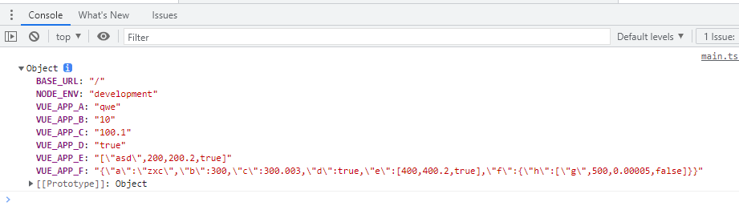
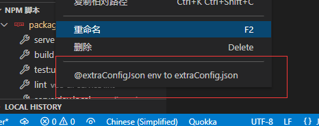
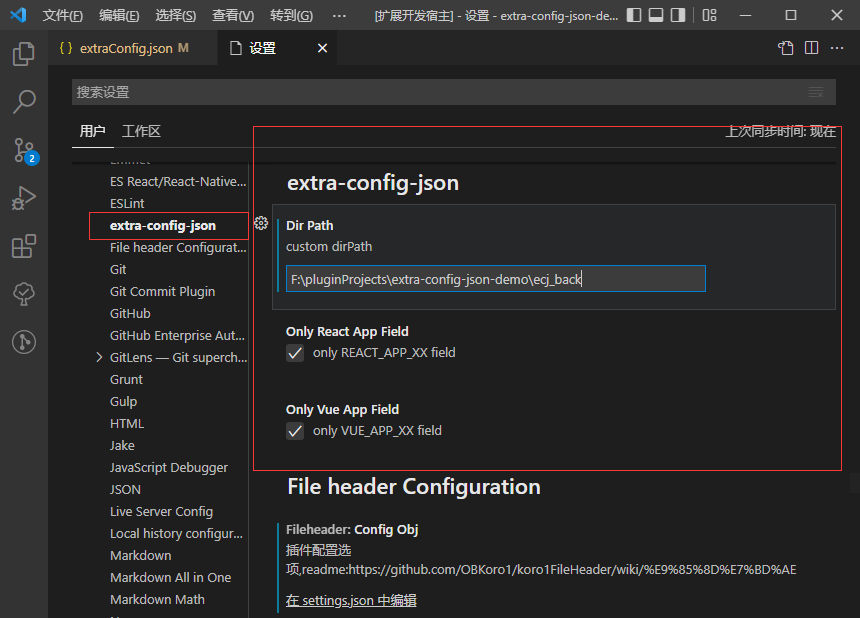
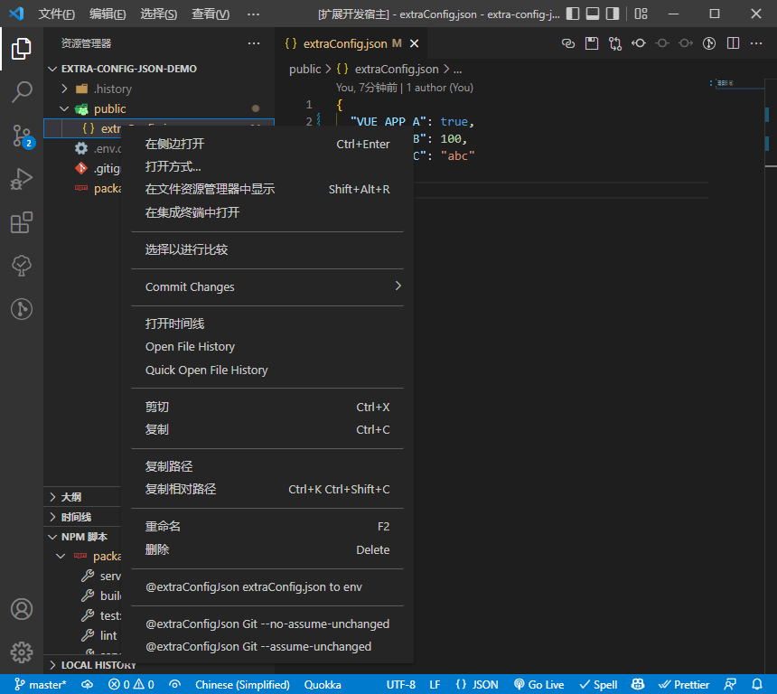

# extra-config-json

[](https://marketplace.visualstudio.com/items?itemName=jawa0919.extra-config-json) [](https://marketplace.visualstudio.com/items?itemName=jawa0919.extra-config-json) [](https://marketplace.visualstudio.com/items?itemName=jawa0919.extra-config-json) [](https://github.com/jawa0919/extra-config-json/issues)

为项目配置文件 `extraConfig.json`/`.env.*.local` 开发的 vscode 插件

快速切换，简单保存，忽略 Git, 生成.env

Quick swap, Simple Save, Git Unchanged and Generate .env

# 功能

- [x] 备份 `extraConfig.json` 到用户目录文件夹(可配置)
- [x] 快速替换本地备份保存的 `extraConfig.json`
- [x] 切换 `extraConfig.json` 自动本地记录历史文件，方便查找溯源
- [x] 忽略 `extraConfig.json` 的变更，`git`提交时无视变更
- [x] `extraConfig.json` 生成 `.env.*.local`
- [x] `.env.*` 生成 `extraConfig.json`
- [x] 生成 `.env.*.local` 时，筛选不符合`vue`的字段前缀 `VUE_APP_` 的数据(可配置)
- [x] 生成 `.env.*.local` 时，筛选不符合`react`的字段前缀 `REACT_APP_` 的数据(可配置)
- [x] 生成 `.env.*.local` 时，筛选不符合`vite`的字段前缀 `VITE_` 的数据(可配置)
- [x] 生成 `.env.*.local` 时，在 `package.json` 中添加执行脚本
- [x] 文件互相转换时，优化对象的层级对 json 文件的影响

---

# 文件互转说明

1. json2env 时字段丢失。 Vue/React 部分字段无法通过`process.env.`编译。

2. json2env 时字段丢失。支持`vite`的字段前缀 `VITE_`。

3. env 文件是使用单行的键值对 k/v 系统存储数据，json 字段可以嵌套对象的情况，二级字段使用`JSON.stringify` 将对象转换为字符串，开发时请使用`JSON.parse` 将字符串转换为对象

   ```json
   {
     "VUE_APP_A": "qwe",
     "VUE_APP_B": 10,
     "VUE_APP_C": 100.1,
     "VUE_APP_D": true,
     "VUE_APP_E": ["asd", 200, 200.2, true],
     "VUE_APP_F": {
       "a": "zxc",
       "b": 300,
       "c": 300.003,
       "d": true,
       "e": [400, 400.2, true],
       "f": {
         "h": ["g", 500, 0.00005, false]
       }
     }
   }
   ```

   ```env
   # .env.dev.local
   VUE_APP_A = qwe
   VUE_APP_B = 10
   VUE_APP_C = 100.1
   VUE_APP_D = true
   VUE_APP_E = ["asd",200,200.2,true]
   VUE_APP_F = {"a":"zxc","b":300,"c":300.003,"d":true,"e":[400,400.2,true],"f":{"h":["g",500,0.00005,false]}}
   ```

   

## 切换/保存

在 `extraConfig.json` 文件右上方有两个功能按钮，点击可以切换/保存`extraConfig.json`文件


## 记录历史

切换`extraConfig.json`文件时会备份文件夹下的`History`文件夹中备份


## git 假设提交

使用`git`假设提交命令，忽略`extraConfig.json`的变更,只对本机生效

右键点击`extraConfig.json`文件时出现两个文件功能选项

- `Git --assume-unchanged @extra-config-json`

  点击后本地修改`extraConfig.json`时，不会触发`git`变更记录，保留其初始版本

- `Git --no-assume-unchanged @extra-config-json` ，

  点击后取消不触发状态

---


```shell
# ignore一个文件的更改又保留其初始版本
git update-index --assume-unchanged [file-path]
# 取消
git update-index --no-assume-unchanged [file-path]
```

## env 互相转换 json

右键点击`extraConfig.json`/`.env.*.local` 文件时出现相关功能选项



## 配置

- 默认备份文件夹为`用户文件目录`下的`.extra-config-json`文件夹

  也可自行配置，在 `vscode`的设置中找到如下配置项，写入文件夹地址

- 默认对 json 文件筛选 `VUE_APP_XXX`开头的字段

- 默认对 json 文件筛选 `REACT_APP_XXX`开头的字段

---



## 其他



欢迎大家 `提出想法` 和 `反馈问题` [issues](https://github.com/jawa0919/extra-config-json/issues)
