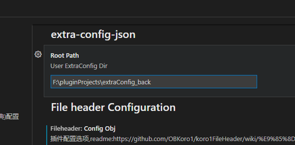

# extra-config-json

`extraConfig.json` Quick swap, Simple Save, Git Unchanged

为项目配置文件`extraConfig.json`开发的插件，对其保存和修改时增加了备份，以及`git`变更监听优化。

## 保存/切换 extraConfig.json

在`extraConfig.json`文件上方会会有两个按钮，`link`和`save`

---


每次切换 json 文件时会在文件夹中的`History`文件夹中备份


---

## git 假设提交

使用`git`假设提交命令，忽略`extraConfig.json`的变更,只本地有效

点击`Git --assume-unchanged` 时，本地修改`extraConfig.json`，不会触发 git

点击`Git --no-assume-unchanged` 时，取消不触发

```shell
# ignore一个文件的更改又保留其初始版本
git update-index --assume-unchanged [file-path]
# 取消
git update-index --no-assume-unchanged [file-path]
```


---

## 配置备份文件夹

默认备份文件夹为`用户目录`下的`.extra-config-json`文件夹，可自行修改



## extra-config-json

欢迎大家提出想法和反馈问题 [issues](https://github.com/jawa0919/extra-config-json/issues)
