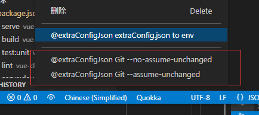

# extra-config-json

[](https://marketplace.visualstudio.com/items?itemName=jawa0919.extra-config-json) [](https://marketplace.visualstudio.com/items?itemName=jawa0919.extra-config-json) [](https://marketplace.visualstudio.com/items?itemName=jawa0919.extra-config-json) [](https://github.com/jawa0919/extra-config-json/issues)

为项目配置文件 `extraConfig.json` 开发的 vscode 插件

快速切换，简单保存，忽略 Git

Quick swap, Simple Save, Git Unchanged

# 功能

- [x] 保存 `extraConfig.json` 到用户目录文件夹备份
- [x] 快速替换本地保存的 `extraConfig.json`
- [x] 本地记录切换历史文件，方便查找溯源
- [x] 本地忽略 `extraConfig.json` 的变更，`git`提交时无视变更
- [x] 自定义备份文件夹
- [x] `extraConfig.json`生成 `.env.*.local`
- [x] `.env.*`生成 `extraConfig.json`
- [ ] 生成配置是，筛选不符合`vue`前缀`VUE_APP_`的数据
- [ ] 生成配置是，筛选不符合`react`前缀`REACT_APP_XX`的数据
- [ ] 在`package.json` 的添加 env 的执行脚本

## 切换/保存

在`extraConfig.json`文件右上方有两个功能按钮，点击可以切换/保存`extraConfig.json`文件


## 记录历史

切换`extraConfig.json`文件时会备份文件夹下的`History`文件夹中备份


## git 假设提交

使用`git`假设提交命令，忽略`extraConfig.json`的变更,只对本机生效

右键点击文件时出现两个文件功能选项

- `Git --assume-unchanged @extra-config-json`

  点击后本地修改`extraConfig.json`时，不会触发`git`变更记录，保留其初始版本

- `Git --no-assume-unchanged @extra-config-json` ，

  点击后取消不触发状态

```shell
# ignore一个文件的更改又保留其初始版本
git update-index --assume-unchanged [file-path]
# 取消
git update-index --no-assume-unchanged [file-path]
```



## 自定义备份文件夹

默认备份文件夹为`用户文件目录`下的`.extra-config-json`文件夹

也可自行配置，在 `vscode`的设置中找到如下配置项，写入文件夹地址


## 其他

欢迎大家 `提出想法` 和 `反馈问题` [issues](https://github.com/jawa0919/extra-config-json/issues)
